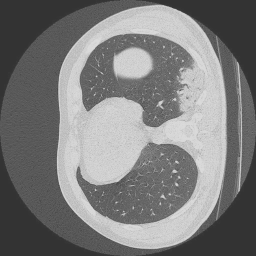

# SSI_Project

Covid-19 CT Scans Segmentaion, Project of Scene Segmentation, and Interpretion

## Project Tasks

| Task    |     Status     |  Notes | Check |
| ------------- |:-------------:|:-----:|:-----:|
| Dataset Understanding      | Done | All |:heavy_check_mark:|
| PreProcessing      | In-Progress   |  All  |:white_check_mark:|
| Augmentation | Pending  |  All  |:white_check_mark:|
| Architecture | Pending  |  All  |:white_check_mark:|
| Training | Pending  |  All  |:white_check_mark:|
| Testing(Predicting) | Pending  |  All  |:white_check_mark:|
| Post-Processing | Pending  |  All  |:white_check_mark:|

## 1. Dataset Understanding 

In [COVID-19-CT-Seg](https://zenodo.org/record/3757476#.Xpz8OcgzZPY) dataset, the last 10 cases from [Radiopaedia](https://radiopaedia.org/articles/covid-19-3) have been adjusted to lung window
[-1250,250], and then normalized to [0,255], we recommend to adjust the first 10 cases from
Coronacases with the same method.

**20** lung CT scans from; Annotations include **left lung**, **right lung** and
**infections**

Images and masks are in Nifti format 3D architecture [2D images, and Slices]

## 2. PreProcessing

 1. Resizing images, and masks to $256 \times 256 $

 2. Normalization (**Min-Max** or **Z-Score** or your suggestion)

 3. Optional (masking ROI with Conventional methods(Watershed as an example))

 4. Any other suggestions?

## 3.  Augmentation:

 Note That Augmentation can be done as seperate standalone code with any platform, or it can be a part ot the data loader/data generator in the main code.

 1. Zooming (in & out)
 2. Horizontal Flip
 3. Shearing with small values
 4. Rotation with no more than 10 degrees
 5. Any Other suggestions?

## Architecture

According to Prof. Abdul Qayyum Efficient Net (B7) is fine, but we can test different Architectures.
To be disscused.
Different Loss Functions to be discussed

## Training

Google Colab can be used, or even your Machines if you prefer.

## Testing(Predicting)

To be discuused later.

## Post-Processing

Morphological Operations such as Closing, Binary Hole Filling, and etc. 
To be discussed later.